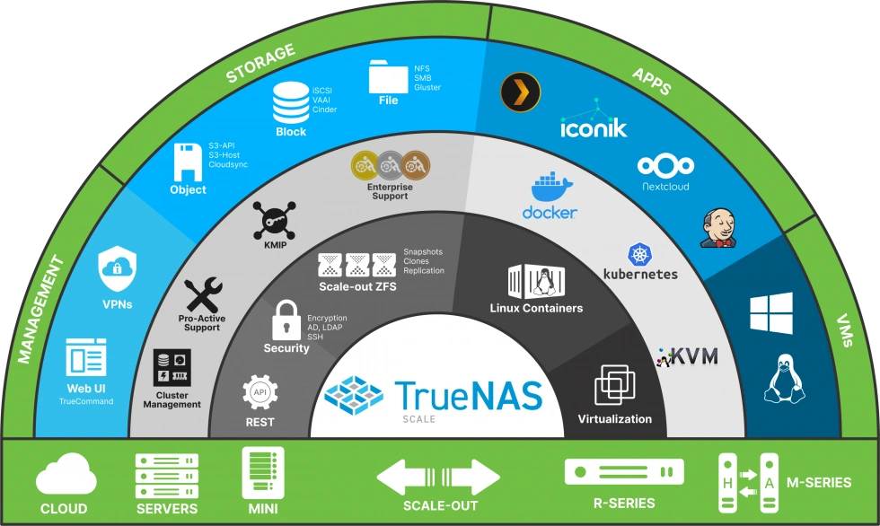
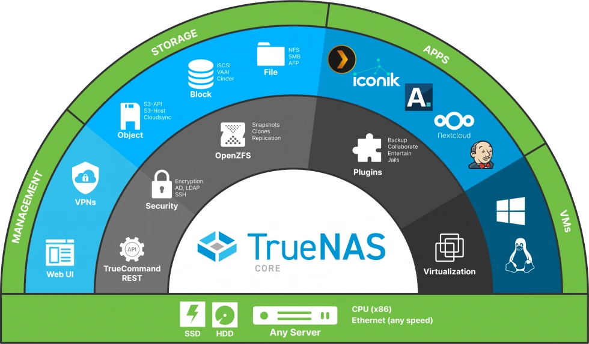

# What OS to install for a homelab?

Well glad you _didn't_ asked, I highly recommend [Truenas Scale](#truenas-scale) as a _appliance_ NAS OS. 

For a general NAS experience without all the bells and whistles then [Truenas Core](#truenas-core) will be a better option for you.

___

## Truenas Scale

A debian based appliance NAS OS. 
 - Development Labs, Data Centers, Large Scale Applications

Download it [here](https://www.truenas.com/download-truenas-scale/).

___

## Truenas Core

A freeBSD based appliance NAS OS. 

- Non-Critical Storage Applications.

Download it [here](https://www.truenas.com/download-truenas-core/).

